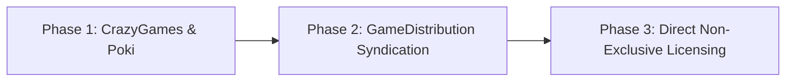

# AutoRick Tour of India — Zero-Overhead Monetization Plan

A practical, low-friction monetization roadmap designed specifically to **maximize revenue while keeping administrative and legal overhead to zero** (no privacy policies, no corporate filings, no developer account fees, and no ongoing server maintenance).

---

## 1. Guiding Constraint: The "Zero-Overhead" Filter

Many standard monetization routes introduce compliance burdens that distract from game design. Applying your constraints immediately eliminates the high-friction paths:

| Monetization Model | Upfront Cost | Requires Privacy Policy? | Legal / Account Overhead | Recommendation |
| :--- | :---: | :---: | :---: | :--- |
| **Google Play / App Store (TWA / Native)** | \$25 – \$99/yr | **YES (Mandatory)** | High (D-U-N-S, COPPA, tax forms, store rejections) | ❌ **SKIP** |
| **Self-Hosted AdSense / AdMob Web** | \$0 | **YES (Mandatory)** | Medium (Cookie consent banner, GDPR CMP, privacy URL) | ❌ **SKIP** |
| **Curated Web Portals (Poki, CrazyGames)** | **\$0** | **NO** (Platform handles all GDPR/COPPA/Privacy) | **Near Zero** (Developer login, PayPal / Bank payout) |  **PHASE 1 (Primary)** |
| **Open Syndication (GameDistribution)** | **\$0** | **NO** (Handled by platform) | **Near Zero** (Upload once, syndicates to 1000+ sites) |  **PHASE 2 (Passive Net)** |
| **Non-Exclusive B2B Licensing** | **\$0** | **NO** (Buyer assumes all compliance) | **Low** (One-time contract / invoice) |  **PHASE 3 (Opportunistic)** |

> [!IMPORTANT]
> **Why Web Portals Solve Your Privacy Policy Constraint**:
> On Poki and CrazyGames, the game runs inside an `<iframe>` hosted directly on *their* domains (`poki.com`, `crazygames.com`). Under EU GDPR and US COPPA law, the **host platform** is legally classified as the "Data Controller." They maintain the privacy policies, serve the cookie banners, manage ad consent, and handle data telemetry. As the game developer, you maintain zero user data and need no privacy policy whatsoever.

---

## 2. Input Investment Required

| Category | Investment Level | Details |
| :--- | :---: | :--- |
| **Financial Cost** | **\$0.00** | Free developer registration; zero hosting fees. |
| **Time to Integrate SDK** | **1 – 2 Hours** | Add their lightweight JS snippet and trigger 2 events: *Game Start* & *Game Over*. |
| **Asset Preparation** | **30 Minutes** | 1 icon (512x512) and 2 promotional screenshots (16:9). |
| **Submission & Review** | **Passive (1–2 weeks)** | Upload a `.zip` file of the repo; wait for QA feedback. |
| **Maintenance Burden** | **Zero** | No server updates, no database backups, no SDK obsolescence issues. |

---

## 3. Realistic Financial Projections & Payout Floors

To set clear expectations, here are the real-world numbers across different performance tiers. Web game platforms pay out on a **50/50 net ad revenue share** basis, with payments issued monthly via **PayPal or Direct Wire (Net-30 / Net-45)**.

### The Realistic Earning Tiers

```
[ Tier 1: Floor / Dud ]       --> $5 - $30 total (One-time fizzle)
[ Tier 2: Modest Long-Tail ]  --> $50 - $250 / month (Steady passive)
[ Tier 3: Category Feature ]  --> $400 - $1,800 / month (Featured in Driving/Runners)
[ Tier 4: Algorithmic Hit ]   --> $3,000 - $15,000+ / month (Homepage carousel)
```

#### Tier 1: The "Bottom of the Barrel" / Worst-Case Scenario
- **What happens**: The game is approved and published, but the initial platform algorithm test doesn't see high retention (average play session < 2 minutes). The game receives no editorial features and sinks into the general archive catalog.
- **Traffic**: 500 – 3,000 total plays.
- **Calculated Earnings**: **\$5 – \$30 total**.
- **Payout Reality**: CrazyGames and Poki have a **\$50 – \$100 minimum payout threshold**. In this absolute worst-case scenario, earnings would sit in your portal balance until cumulative plays slowly cross the threshold or another title is added.

#### Tier 2: The "Modest Long-Tail" Scenario (Most Common Baseline)
- **What happens**: The game gets decent organic plays from tag searches (*"driving games"*, *"rickshaw"*, *"indian games"*). Players enjoy 2–3 runs per session.
- **Traffic**: 15,000 – 60,000 plays / month.
- **Calculated Earnings**: **\$50 – \$250 / month**.
- **Payout Reality**: Clears the payout threshold every 1–2 months directly to PayPal. Covers coffee/dinner passively without touching the code again.

#### Tier 3: The "Category Feature" Scenario
- **What happens**: Because of the game's unique Indian theme, snappy load speed (<1s), and custom audio, Poki or CrazyGames editors feature it in the *"New Driving Games"* or *"Top Runners"* tray for 1–2 weeks.
- **Traffic**: 150,000 – 500,000 plays / month.
- **Calculated Earnings**: **\$400 – \$1,800 / month** (during peak feature months, tapering to Tier 2).

#### Tier 4: The "Front-Page Hit" (Upside Case)
- **What happens**: The game goes viral among school Chromebook players or hits the platform homepage carousel.
- **Traffic**: 1,000,000 – 4,000,000+ plays / month.
- **Calculated Earnings**: **\$3,000 – \$15,000+ / month**.

---

## 4. Phased Monetization Roadmap



### Phase 1: Tier-1 Curated Web Portals (Target: CrazyGames & Poki)
*Start here. This requires the least effort for the highest payout.*

1. **CrazyGames Developer Portal** ([developer.crazygames.com](https://developer.crazygames.com)):
   - **Why first**: Faster approval turnaround (often 3–7 business days) and very friendly to indie developers.
   - **Integration**:
     - Embed their script in `index.html`: `<script src="https://sdk.crazygames.com/crazygames-sdk-v3.js"></script>`
     - Call `window.CrazyGames.SDK.ad.requestAd('midgame')` when the player dies and clicks "Drive Again".
     - Optional: Call `window.CrazyGames.SDK.ad.requestAd('rewarded')` to offer *"Watch Ad to Revive Rickshaw with 100% Health"*.
2. **Poki for Developers** ([developers.poki.com](https://developers.poki.com)):
   - **Why second**: Higher overall volume (~60M players), but slightly stricter curation standards. Submit the build after testing on CrazyGames.
   - **Integration**: Poki SDK uses identical events (`PokiSDK.commercialBreak()` on game over).

---

### Phase 2: Open Syndication Network (Target: GameDistribution / GamePix)
*Only execute after Phase 1 is live.*

- **How it works**: Platforms like **GameDistribution (by Azerion)** take your HTML5 zip file and syndicate it to over **1,500+ independent gaming websites**, telecom portals, and international browser landing pages.
- **Advantage**: Zero maintenance. You upload the build once, and it earns residual long-tail revenue across hundreds of small web portals worldwide.
- **Realistic Payout**: Typically **\$20 – \$150 / month** in long-tail passive revenue.

---

### Phase 3: Non-Exclusive B2B Licensing (Cash Upfront)
*If you prefer guaranteed cash rather than waiting on ad impressions.*

- **How it works**: Telecom operators, airline in-flight entertainment systems, and overseas web portals often buy non-exclusive licenses for family-friendly HTML5 games.
- **Model**: You sell a branded or unbranded copy of the game files for a one-time flat fee (\$300 – \$1,500 per license).
- **Advantage**: You get paid cash upfront, retain full IP ownership, and have zero privacy or GDPR obligations (the licensing client assumes all liability).
- **Where to list**: FGL, GamePix licensing, or direct outreach to telecom content aggregators in India and SE Asia.

---

## 5. Technical Integration Preview (What Code Actually Changes)

To demonstrate how minimal the code changes are, here is the entire integration required for your existing [game.js](file:///Users/vikrantnanda/.gemini/antigravity/scratch/auto-rickshaw-game/game.js):

```javascript
// 1. Tell platform game is loaded
window.addEventListener('load', () => {
  if (window.CrazyGames) CrazyGames.SDK.game.loadingStop();
});

// 2. Tell platform gameplay has begun (pauses menu background ads)
function startGame() {
  if (window.CrazyGames) CrazyGames.SDK.game.gameplayStart();
  // ... existing startGame code ...
}

// 3. Trigger skippable ad break between runs
function triggerGameOver() {
  if (window.CrazyGames) {
    CrazyGames.SDK.game.gameplayStop();
    CrazyGames.SDK.ad.requestAd('midgame', {
      adStarted: () => gameAudio.stopEngine(),
      adFinished: () => {} // Ready for next drive
    });
  }
  // ... existing triggerGameOver code ...
}
```

---

## 6. Summary Checklist & Recommendation

If you decide to monetize:
-  **Do NOT bother with Google Play / Apple App Store**: The \$25–\$99 fees, mandated public privacy policies, and ongoing compliance requirements are not worth the friction for a casual web game.
-  **Do NOT setup custom AdSense accounts**: Requires cookie consent management and privacy disclaimers on your site.
-  **DO apply to CrazyGames first**: It gives you a clean, zero-risk, zero-compliance test run. If it earns \$50–\$200/month passively, great! If it hits the floor (\$10–\$20), you spent less than 2 hours and lost nothing.
